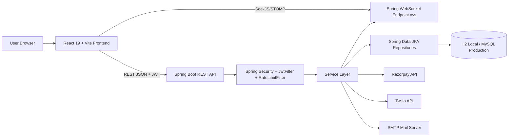
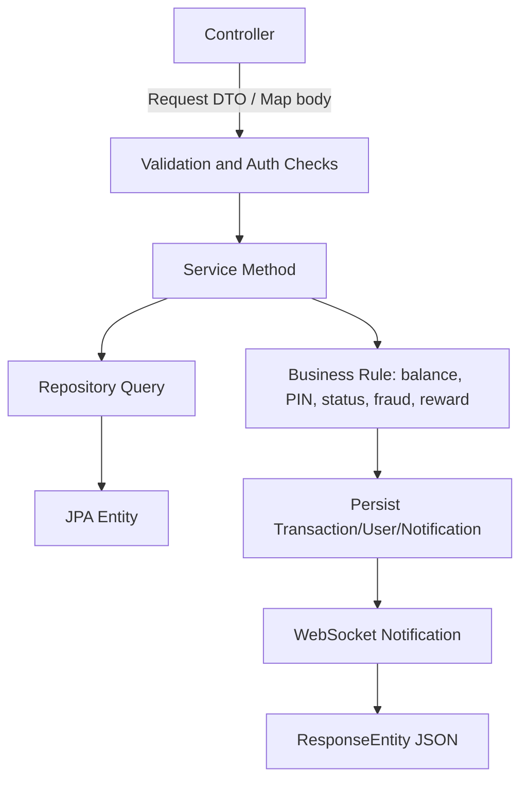
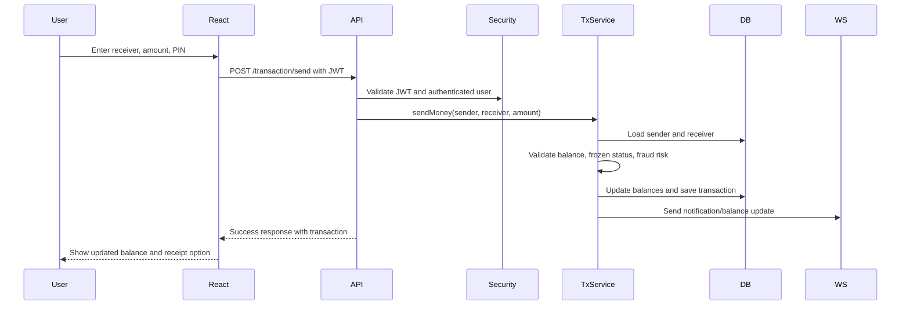
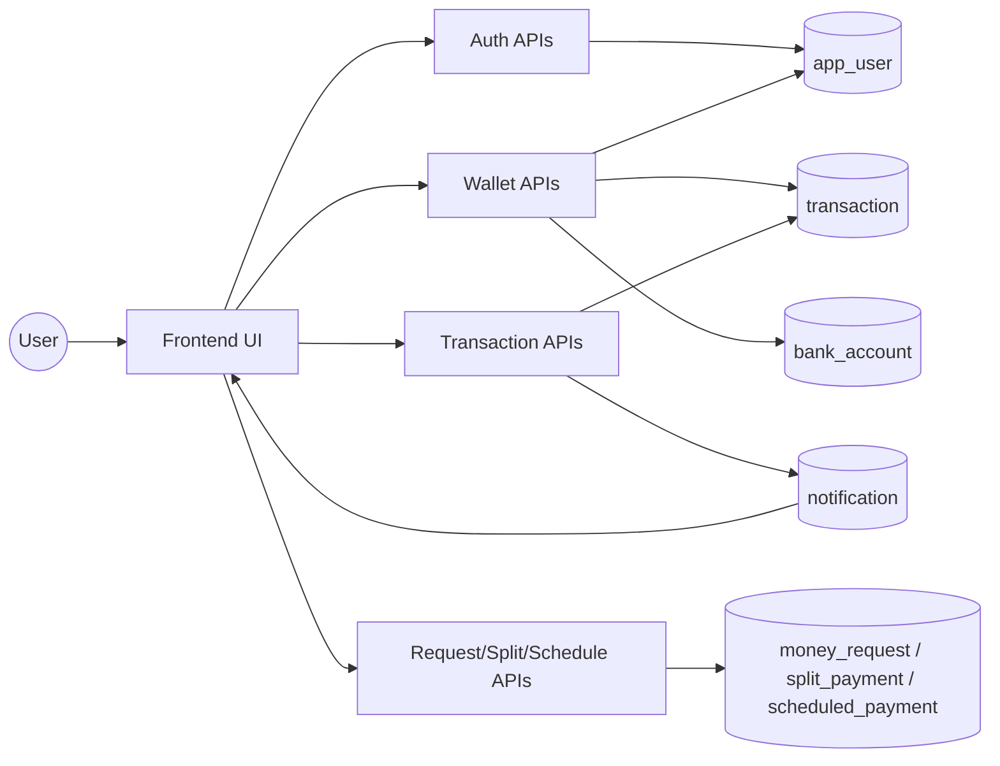
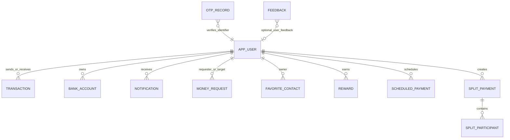

# PayFlow Complete Project Documentation and Interview Preparation Report

Prepared for: College Viva, Internship Interviews, Placement Interviews, Project Presentation, Resume Documentation  
Project name: PayFlow  
Project type: Full-stack digital wallet and payment system  
Backend: Java 17, Spring Boot, Spring Security, Spring Data JPA, WebSocket/STOMP, JWT, Razorpay, Twilio, Mail, H2/MySQL  
Frontend: React 19, Vite, React Router, Recharts, STOMP/SockJS, jsPDF, html2canvas  
Generated date: 2026-06-06

\pagebreak

## Table of Contents

1. Executive Summary
2. Technical Architecture
3. Technology Stack Explanation
4. Folder Structure Explanation
5. Complete Function Documentation
6. Database Documentation
7. REST API Documentation
8. Security Features
9. Feature-Wise Explanation
10. Viva Questions and Answers
11. HR Interview Questions
12. Project Presentation Slides
13. Resume Description
14. Interview Cheat Sheet
15. PDF Formatting Guide

\pagebreak

## 1. Executive Summary

### 1.1 Project Overview

PayFlow is a full-stack digital wallet and payment platform. It allows users to register, log in, manage wallet balance, send money, request money, split payments, schedule recurring payments, pay bills, claim rewards, manage linked bank accounts, generate QR codes, export statements, and receive real-time notifications. The backend exposes secured REST APIs through Spring Boot, while the frontend provides a React-based user interface.

### 1.2 Problem Statement

Users need a secure and convenient way to perform small digital payments, wallet transfers, payment requests, bill payments, and financial tracking from one place. Traditional manual transfers lack unified transaction history, fraud indicators, real-time updates, QR flows, rewards, and student-friendly explainability.

### 1.3 Existing System

Existing payment systems often work as isolated modules: bank apps handle bank transfers, wallet apps manage stored balance, and spreadsheet/manual records track expenses. Some systems provide only basic send/receive features and do not expose educational architecture, admin controls, or project-level extensibility.

### 1.4 Drawbacks of Existing System

- Users must switch between different tools for wallet, bank, request, rewards, and analytics workflows.
- Manual tracking makes transaction search and category analysis difficult.
- Many basic systems do not support real-time notifications.
- Refund, fraud-risk preview, split payments, and scheduled payments are often absent.
- Admin monitoring and user blocking are missing in simple wallet projects.

### 1.5 Proposed System

PayFlow provides one integrated wallet platform with authentication, JWT security, transaction PIN protection, wallet balance management, transaction history, fraud-risk preview, bill payments, money requests, split payments, scheduled payments, QR code payments, rewards, referral benefits, notifications, and an admin panel.

### 1.6 Objectives

- Build a secure digital wallet using Spring Boot and React.
- Provide REST APIs for users, wallet, transactions, requests, rewards, bank accounts, and admin actions.
- Persist data using JPA entities and H2/MySQL databases.
- Protect APIs with JWT, BCrypt password hashing, role-based access, and transaction PIN checks.
- Deliver a responsive frontend with protected routes and real-time WebSocket notifications.
- Provide analytics, PDF/CSV exports, and presentation-ready transaction visibility.

### 1.7 Scope of Project

The system covers user registration, login, wallet balance, money transfer, request money, scheduled payments, split payments, rewards, referrals, QR generation, bill payments, linked bank accounts, favorite contacts, feedback, notifications, and admin monitoring. It is suitable as a college-level or internship-level full-stack project and can be extended toward production fintech features.

### 1.8 Benefits

- Unified payment and wallet workflows.
- Real-time notification and balance updates.
- Stronger security through JWT, BCrypt, role checks, rate limiting, and PIN verification.
- Modular backend architecture using controller, service, repository, model, DTO, config, and security layers.
- Interview-friendly technology coverage across Java, Spring Boot, React, REST APIs, database design, security, and system design.

### 1.9 Future Enhancements

- Add actual bank payout settlement and UPI integration.
- Add ledger-based double-entry accounting for stronger financial consistency.
- Add KYC and document verification.
- Add device fingerprinting and machine-learning fraud detection.
- Add automated scheduled-payment executor jobs.
- Add refresh-token persistence and token revocation lists.
- Add production observability through logs, metrics, tracing, and alerting.
- Add end-to-end tests for critical payment flows.

\pagebreak

## 2. Technical Architecture

### 2.1 System Architecture



### 2.2 High-Level Design

The frontend handles routing, forms, protected pages, local token storage, API calls, visual analytics, QR scanning, and document exports. The backend handles validation, authentication, authorization, business rules, transaction creation, wallet balance updates, notifications, persistence, and third-party integrations.

### 2.3 Low-Level Design



### 2.4 Workflow Diagram: Send Money



### 2.5 Data Flow Diagram



### 2.6 ER Diagram



### 2.7 API Architecture

APIs are grouped by domain: `/user`, `/wallet`, `/transaction`, `/bank`, `/contacts`, `/request-money`, `/split`, `/scheduled-payments`, `/bill-payments`, `/rewards`, `/referral`, `/qr`, `/notifications`, `/api/feedback`, `/admin`, `/otp`, and `/api/email-otp`.

### 2.8 Frontend Architecture

React uses page components for each workflow, context providers for authentication, theme, language, and WebSocket state, a central `apiFetch` helper for JWT-aware requests, shared components such as `Layout`, `Toast`, `PinModal`, and `UserAvatar`, and utility modules for PDF/CSV statement generation.

### 2.9 Backend Architecture

The backend follows a layered Spring Boot structure:

- Controller layer receives HTTP requests and maps endpoints.
- Service layer contains business logic.
- Repository layer performs database access through Spring Data JPA.
- Model layer defines persisted JPA entities.
- DTO layer defines structured request payloads.
- Security layer handles JWT parsing, authentication, authorization, BCrypt, and rate limiting.
- Config layer handles CORS and WebSocket/STOMP setup.

\pagebreak

## 3. Technology Stack Explanation

| Technology | Definition | Why Used | Advantages | Alternatives | Interview Questions |
|---|---|---|---|---|---|
| Java 17 | Object-oriented backend language | Stable enterprise backend development | Strong typing, JVM ecosystem, mature tooling | Kotlin, C#, Node.js | Why Java for payment systems? What are records, streams, exceptions? |
| Spring Boot | Java application framework | Rapid REST API development | Auto-configuration, embedded server, dependency injection | Micronaut, Quarkus, Express | What is auto-configuration? What is dependency injection? |
| Spring Web MVC | REST controller framework | Exposes HTTP endpoints | Annotation-based routing, JSON binding | JAX-RS, Express | Difference between `@Controller` and `@RestController`? |
| Spring Security | Authentication and authorization framework | Protects APIs | Filter chain, role checks, BCrypt integration | Apache Shiro, custom filters | How does Spring Security filter chain work? |
| JWT | Signed token format | Stateless API authentication | Scalable, frontend-friendly, carries claims | Sessions, OAuth opaque tokens | What are JWT header, payload, signature? |
| BCrypt | Password hashing algorithm | Secure password/PIN storage | Salted, slow hash, brute-force resistant | Argon2, PBKDF2 | Why not store plain passwords? |
| Spring Data JPA | ORM repository abstraction | Simplifies database access | Less boilerplate, derived queries, entity mapping | JDBC, MyBatis | What is JPA? What is Hibernate? |
| Hibernate | JPA implementation | Entity persistence and schema updates | ORM, lazy loading, dialect support | EclipseLink | What is lazy vs eager loading? |
| H2 | Embedded database | Local development and tests | Easy setup, file/in-memory modes | SQLite, Derby | Why use H2 locally? |
| MySQL | Relational database | Production persistence | ACID, indexing, reliability | PostgreSQL, MariaDB | What are primary and foreign keys? |
| React 19 | Frontend UI library | Component-based SPA | Reusable components, state model, ecosystem | Angular, Vue, Svelte | What are hooks? What is virtual DOM? |
| Vite | Frontend build tool | Fast development server and bundling | Quick HMR, simple config | Webpack, Parcel | Why Vite over Webpack? |
| React Router | Client-side routing | Page navigation and protected routes | Declarative routes, nested layouts | TanStack Router | How do protected routes work? |
| Recharts | Charting library | Analytics dashboard | React-native chart components | Chart.js, D3 | How do you visualize transaction data? |
| WebSocket/STOMP | Real-time messaging | Notifications and balance updates | Low-latency push updates | SSE, polling | Why WebSocket instead of polling? |
| SockJS | WebSocket fallback library | Browser compatibility | Works when native WS is unavailable | Native WebSocket | What is SockJS fallback behavior? |
| Razorpay | Payment gateway SDK | Wallet top-up order and verification | Real payment integration, webhooks | Stripe, PayPal | How do payment signatures prevent tampering? |
| Twilio | Communication API | OTP/SMS capability | Reliable SMS integration | Firebase Auth, AWS SNS | How would OTP expiry be handled? |
| Spring Mail | Email integration | Email OTP and password reset | SMTP support, simple API | SendGrid, Mailgun | How do you secure email credentials? |
| ZXing | QR generation library | Payment QR creation | Mature barcode/QR generation | QRGen | What data should a payment QR contain? |
| Bucket4j | Rate limiting library | Blocks request abuse | Token bucket algorithm, filter integration | Redis rate limiter, Resilience4j | Explain token bucket rate limiting. |
| Maven | Java build tool | Dependency and build management | Standard lifecycle, reproducible builds | Gradle | What is `pom.xml`? |
| npm | JavaScript package manager | Frontend dependency management | Large ecosystem, script runner | pnpm, Yarn | What is `package-lock.json`? |
| Docker | Container platform | Deployment packaging | Portable runtime, consistent environments | Buildpacks, VM images | Why containerize backend? |
| Git/GitHub | Version control and collaboration | Source history and hosting | Branching, PRs, CI/CD | GitLab, Bitbucket | What is a commit, branch, and pull request? |

\pagebreak

## 4. Folder Structure Explanation

```text
PayFlow/
|-- frontend/
|   |-- src/
|   |   |-- pages/
|   |   |-- components/
|   |   |-- context/
|   |   |-- utils/
|   |   |-- api.js
|   |   |-- App.jsx
|   |   `-- main.jsx
|   |-- package.json
|   |-- vite.config.js
|   `-- vercel.json
|-- demo/
|   |-- src/main/java/payment_system_backend/
|   |   |-- controller/
|   |   |-- service/
|   |   |-- repository/
|   |   |-- model/
|   |   |-- dto/
|   |   |-- security/
|   |   |-- config/
|   |   `-- PaymentSystemBackendApplication.java
|   |-- src/main/resources/
|   |-- src/test/java/
|   |-- pom.xml
|   `-- Dockerfile
|-- README.md
|-- DEPLOYMENT.md
|-- Dockerfile
|-- railway.json
`-- .env.example
```

| Path | Purpose |
|---|---|
| `frontend/src/pages` | Feature screens: dashboard, login, transactions, send money, settings, QR, admin, etc. |
| `frontend/src/components` | Shared UI components such as layout shell, toast, avatar, and PIN modal. |
| `frontend/src/context` | React context providers for authentication, theme, language, and WebSocket state. |
| `frontend/src/utils` | Export utilities for transaction receipts and statements. |
| `frontend/src/api.js` | Central API helper with token attachment and refresh retry. |
| `frontend/package.json` | Frontend scripts and dependency manifest. |
| `demo/src/main/java/.../controller` | REST endpoint classes. |
| `demo/src/main/java/.../service` | Business logic classes. |
| `demo/src/main/java/.../repository` | Spring Data JPA repository interfaces. |
| `demo/src/main/java/.../model` | JPA entities mapped to database tables. |
| `demo/src/main/java/.../dto` | Request payload classes. |
| `demo/src/main/java/.../security` | JWT utilities, security filter, rate limiter, and security configuration. |
| `demo/src/main/java/.../config` | CORS and WebSocket configuration. |
| `demo/src/main/resources/application.properties` | Main backend configuration and environment variable mappings. |
| `demo/src/main/resources/application-local.properties` | Local H2 profile settings. |
| `demo/src/main/resources/application-mysql.properties` | Production MySQL profile settings. |
| `demo/pom.xml` | Backend dependencies and build configuration. |
| `.env.example` | Required environment variables for deployment. |

\pagebreak

## 5. Complete Function Documentation

This project contains many Java accessors and React inline handlers. For viva and interview use, the important functions are grouped by business behavior. Getter/setter methods in DTOs and entities are O(1), return or assign a single field, and have edge cases limited to null/invalid caller values unless validation is applied by controllers/services.

### 5.1 Backend Controller Method Catalog

| Class | Function | Purpose | Complexity | Key Edge Cases |
|---|---|---|---|---|
| `UserController` | `registerUser` | Create user account | O(1) plus DB | Duplicate email/phone, weak password, missing fields |
| `UserController` | `login` | Authenticate and return tokens | O(1) plus DB/hash | Wrong password, blocked user, email/phone login ambiguity |
| `UserController` | `refresh` | Issue new access token | O(1) | Missing/expired refresh token |
| `UserController` | `getUserById` | Fetch user details | O(1) plus DB | User not found |
| `UserController` | `deleteUser` | Delete user | O(1) plus DB | User not found, related data |
| `UserController` | `updateProfilePicture` | Save profile picture URL/data | O(1) | Empty image, large payload |
| `UserController` | `pinStatus` | Check whether PIN exists | O(1) | Unauthenticated user |
| `UserController` | `setTransactionPin` | Create/update PIN with BCrypt | O(1) plus hash | PIN length, mismatch, wrong old PIN |
| `UserController` | `checkBalance` | Verify PIN and return balance | O(1) | Missing PIN, wrong PIN |
| `UserController` | `sendForgotPasswordOtp` | Send reset OTP | O(1) plus mail | Unknown email, mail failure |
| `UserController` | `resetPassword` | Verify OTP and update password | O(1) plus hash | Expired OTP, weak password |
| `UserController` | `makeAdmin` | Promote a user | O(1) | Unauthorized caller |
| `WalletController` | `addMoney` | Add wallet balance | O(1) | Invalid amount, wrong PIN |
| `WalletController` | `createPaymentOrder` | Create Razorpay order | O(1) plus gateway | Invalid amount, gateway credentials missing |
| `WalletController` | `verifyPayment` | Verify Razorpay signature and credit wallet | O(1) plus gateway/DB | Invalid signature, duplicate order |
| `WalletController` | `withdrawToBank` | Withdraw wallet balance | O(1) | Insufficient balance, invalid bank account |
| `WalletController` | `razorpayWebhook` | Receive payment gateway event | O(1) | Invalid webhook signature |
| `TransactionController` | `sendMoney` | Transfer wallet amount between users | O(1) plus DB | Self transfer, frozen account, insufficient balance |
| `TransactionController` | `riskPreview` | Estimate fraud risk before transfer | O(n) over recent history | Unknown receiver, abnormal amount |
| `TransactionController` | `history` | List user transactions | O(n) | Invalid date/status filters |
| `TransactionController` | `searchHistory` | Search/filter transactions | O(n) | Empty query, bad date |
| `TransactionController` | `requestRefund` | Mark refund request pending | O(1) | Already refunded, unauthorized requester |
| `TransactionController` | `retryPayment` | Retry failed transaction | O(1) | Transaction not failed |
| `TransactionController` | `analytics` | Return aggregate analytics | O(n) | Empty history, invalid period |
| `BankAccountController` | `getAccounts` | List linked bank accounts | O(n) | User has no accounts |
| `BankAccountController` | `addAccount` | Add masked bank account | O(1) | Account mismatch, invalid IFSC, duplicates |
| `BankAccountController` | `removeAccount` | Delete linked account | O(1) | Account not found |
| `BankAccountController` | `setPrimary` | Mark account as primary | O(n) | Account belongs to another user |
| `MoneyRequestController` | `create` | Create money request | O(1) | Self request, invalid amount |
| `MoneyRequestController` | `accept` | Pay accepted request | O(1) | Wrong PIN, insufficient balance |
| `MoneyRequestController` | `decline` | Decline incoming request | O(1) | Not target user |
| `MoneyRequestController` | `cancel` | Cancel outgoing request | O(1) | Not requester |
| `SplitPaymentController` | `createSplit` | Create split group and participants | O(p) | Invalid participants, duplicate participants |
| `SplitPaymentController` | `payShare` | Mark participant share paid | O(p) | Already paid, user not participant |
| `ScheduledPaymentController` | `create` | Store recurring payment definition | O(1) | Invalid date/frequency/PIN |
| `ScheduledPaymentController` | `updateStatus` | Pause/resume/cancel schedule | O(1) | Unauthorized owner, invalid status |
| `BillPaymentController` | `payBill` | Pay bill and record transaction | O(1) | Invalid provider/account, low balance |
| `RewardController` | `getRewards` | Return reward summary | O(n) | No rewards |
| `RewardController` | `claimDailyBonus` | Add daily bonus once per day | O(n) | Already claimed |
| `ReferralController` | `getReferralCode` | Return/generate referral code | O(1) | User not found |
| `ReferralController` | `claimReferral` | Grant referral rewards | O(1) | Self referral, duplicate claim |
| `QrController` | `generateQr` | Generate PNG QR code | O(w*h) | Unknown user, QR encoding error |
| `NotificationController` | `getNotifications` | List notifications | O(n) | No notifications |
| `NotificationController` | `markRead` | Mark one notification read | O(1) | Notification not found |
| `AdminController` | `getStats` | Return admin dashboard metrics | O(n) | Unauthorized access |
| `AdminController` | `blockUser`/`unblockUser` | Freeze or unfreeze account | O(1) | User not found |
| `AdminController` | `approveRefund`/`rejectRefund` | Resolve refund request | O(1) | Non-pending refund |

### 5.2 Backend Service Method Catalog

| Service | Important Functions | Responsibility |
|---|---|---|
| `UserService` | create, fetch, delete user operations | User persistence and account workflow support |
| `WalletService` | add money, withdrawal support | Balance mutation and wallet transaction creation |
| `TransactionService` | transfer, refund, retry, history | Core money movement and transaction lifecycle |
| `FraudDetectionService` | risk scoring and level calculation | Detect high-risk amounts, frequency, and unusual activity |
| `PaymentGatewayService` | order creation, signature verification, webhook verification | Razorpay integration boundary |
| `OtpService` | generate, store, verify OTP | OTP lifecycle for registration/login/password reset |
| `NotificationService` | create notification, push over WebSocket | Real-time and persisted notification delivery |
| `RewardService` | add transaction reward, daily bonus, referral reward | User points and reward history |
| `MoneyRequestService` | create/accept/decline/cancel request | Request-money domain workflow |
| `SplitPaymentService` | create split, pay share, list splits | Split payment group workflow |
| `ScheduledPaymentService` | create, list, update, delete schedule | Recurring payment metadata workflow |
| `BillPaymentService` | `payBill`, `buildDescription` | Bill payment transaction and cashback/points |
| `AdminService` | stats, block/unblock, refund review | Admin operations and reporting |
| `FeedbackService` | save feedback | Public feedback capture |

### 5.3 Frontend Function Catalog

| File | Functions | Purpose |
|---|---|---|
| `src/api.js` | `apiFetch`, `tryRefreshToken` | Attach JWT, retry expired token with refresh flow |
| `App.jsx` | `PrivateRoute`, `AdminRoute`, `PublicRoute`, `App` | Route protection and app routing |
| `AuthContext.jsx` | `login`, `logout`, `updateUser`, `refreshUser`, `useAuth` | Store and update authenticated user/session |
| `WebSocketContext.jsx` | `connect`, subscriptions, `useWebSocket` | Subscribe to notification and balance channels |
| `ThemeContext.jsx` | `changeTheme`, `useTheme` | Theme persistence |
| `LanguageContext.jsx` | `changeLanguage`, `t`, `useLanguage` | Simple translation dictionary |
| `Dashboard.jsx` | balance loaders, add money, withdraw, claim reward | Main wallet dashboard |
| `SendMoney.jsx` | recipient lookup, fraud preview, PIN submit, send | Transfer workflow |
| `RequestMoney.jsx` | fetch incoming/outgoing, create, accept, decline, cancel | Money request workflow |
| `Transactions.jsx` | filtering, summary, export actions | Transaction history view |
| `Analytics.jsx` | chart data loading, tab/period selection | Spending analytics |
| `Settings.jsx` | profile, PIN, bank accounts, contacts, theme/language | Account settings |
| `QRPage.jsx` | scan QR, upload QR, download/share QR | QR workflow |
| `SplitPayment.jsx` | load splits, add participants, create, pay | Split payment workflow |
| `ScheduledPayments.jsx` | build payload, create, update status, delete | Scheduled payment workflow |
| `BillPayments.jsx` | bill type selection, cashback preview, submit | Bill payment workflow |
| `AdminPanel.jsx` | stats/users/refund loading, block/unblock, approve/reject | Admin dashboard |
| `generateReceipt.js` | `generateReceipt` | Create transaction receipt PDF |
| `exportStatement.js` | `exportTransactionsCsv`, `exportTransactionsPdf` | Export transaction statement |

### 5.4 Detailed Function Documentation: `TransactionController.sendMoney`

Purpose: Transfers money from the authenticated sender to a receiver and records the transaction.

Parameters:
- `body`: request map containing receiver identifier, amount, description/category, and transaction PIN.
- `authentication`: Spring Security authentication object representing the logged-in user.

Return type: `ResponseEntity<Map<String, Object>>` with success/failure message, transaction data, and updated balance.

Business logic:
1. Read current user from JWT authentication.
2. Validate sender is active and transaction PIN is correct.
3. Parse receiver and amount from request.
4. Check receiver exists and is not the sender.
5. Preview fraud risk and validate balance.
6. Delegate transfer to service/repository logic.
7. Award reward points if applicable.
8. Send notifications and balance updates.
9. Return response.

Time complexity: O(1) for normal transfer operations, plus O(n) if risk preview scans recent history.  
Space complexity: O(1).  
Edge cases: insufficient balance, invalid PIN, negative amount, same sender/receiver, frozen account, receiver not found, fraud threshold failure.  
Example input:

```json
{ "receiverId": 2, "amount": 500, "transactionPin": "123456", "description": "Lunch split" }
```

Example output:

```json
{ "message": "Money sent successfully", "balance": 1500.0, "transactionId": 45 }
```

Possible interview questions:
- Why should transfer logic be transactional?
- How would you prevent race conditions during concurrent transfers?
- Why is transaction PIN separate from login password?

Code walkthrough: The controller validates request/user context, delegates core payment rules to the transaction service, updates persistence through repositories, and returns a JSON response. In production, the debit/credit and transaction insert should be inside one database transaction.

### 5.5 Detailed Function Documentation: `apiFetch`

Purpose: Provides a central frontend wrapper around `fetch` for API calls.

Parameters:
- `path`: backend path such as `/user/login` or `/transaction/send`.
- `options`: fetch options including method, headers, and body.

Return type: `Promise<Response>`.

Business logic:
1. Read access token from local storage.
2. Attach `Authorization: Bearer <token>` when available.
3. Send request to configured API base URL.
4. If response is unauthorized, attempt refresh-token flow.
5. Retry original request with new access token.
6. Return final response to caller.

Time complexity: O(1).  
Space complexity: O(1).  
Edge cases: missing token, expired refresh token, backend offline, invalid JSON response, refresh retry loop.  
Example input: `apiFetch('/transaction/history/1')`  
Example output: HTTP response containing transaction array.  
Interview questions:
- Why centralize API calls?
- How do you avoid infinite refresh retries?
- Where should tokens be stored for better security?

\pagebreak

## 6. Database Documentation

### 6.1 Main Tables

| Table | Purpose | Primary Key | Important Relationships |
|---|---|---|---|
| `app_user` | Stores user account, balance, role, PIN, referral, profile | `id` | Referenced by user ID columns in transactions, rewards, notifications, requests |
| `transaction` | Stores wallet transfers, bill payments, gateway top-ups, refunds | `id` | `sender_id` and `receiver_id` refer logically to users |
| `bank_account` | Stores linked bank account metadata | `id` | Belongs to `app_user` through `user_id` |
| `notification` | Stores user notifications | `id` | Belongs to user through `user_id` |
| `money_request` | Stores payment requests | `id` | `requester_id` and `target_user_id` refer to users |
| `favorite_contact` | Stores saved recipient contacts | `id` | Owner user and contact user |
| `reward` | Stores reward point events | `id` | Belongs to user through `user_id` |
| `scheduled_payment` | Stores recurring payment setup | `id` | Sender and receiver user IDs |
| `split_payment` | Stores split group header | `id` | Creator user ID |
| `split_participant` | Stores split group participants | `id` | Many-to-one with `split_payment` |
| `otp_records` | Stores generated OTP values with creation time | `id` | Identifier maps to email/phone |
| `feedback` | Stores public feedback submissions | `id` | Optional user association by email |

### 6.2 SQL Schema Documentation

```sql
CREATE TABLE app_user (
  id BIGINT PRIMARY KEY AUTO_INCREMENT,
  name VARCHAR(255),
  email VARCHAR(255),
  password VARCHAR(255),
  balance DOUBLE NOT NULL,
  account_age_days INT DEFAULT 0,
  phone_number VARCHAR(255) UNIQUE,
  profile_picture_url TEXT,
  referral_code VARCHAR(255) UNIQUE,
  referred_by VARCHAR(255),
  role VARCHAR(20) DEFAULT 'USER',
  frozen BOOLEAN DEFAULT FALSE,
  transaction_pin VARCHAR(255),
  last_login_at DATETIME
);

CREATE TABLE transaction (
  id BIGINT PRIMARY KEY AUTO_INCREMENT,
  sender_id BIGINT,
  receiver_id BIGINT,
  amount DOUBLE NOT NULL,
  status VARCHAR(255),
  time DATETIME,
  risk_score DOUBLE DEFAULT 0,
  risk_level VARCHAR(10) DEFAULT 'LOW',
  category VARCHAR(30) DEFAULT 'TRANSFER',
  description VARCHAR(255),
  refund_status VARCHAR(20),
  refund_requested_by BIGINT,
  gateway_provider VARCHAR(30),
  gateway_order_id VARCHAR(100) UNIQUE,
  gateway_payment_id VARCHAR(100),
  gateway_signature VARCHAR(255),
  gateway_status VARCHAR(30),
  failure_reason VARCHAR(255),
  currency VARCHAR(3) DEFAULT 'INR'
);

CREATE TABLE bank_account (
  id BIGINT PRIMARY KEY AUTO_INCREMENT,
  user_id BIGINT NOT NULL,
  account_holder_name VARCHAR(255),
  account_number VARCHAR(255),
  account_number_full VARCHAR(255),
  ifsc_code VARCHAR(255),
  bank_name VARCHAR(255),
  account_type VARCHAR(255),
  is_primary BOOLEAN DEFAULT FALSE
);

CREATE TABLE notification (
  id BIGINT PRIMARY KEY AUTO_INCREMENT,
  user_id BIGINT NOT NULL,
  title VARCHAR(100) NOT NULL,
  message VARCHAR(500) NOT NULL,
  type VARCHAR(20) DEFAULT 'INFO',
  is_read BOOLEAN DEFAULT FALSE,
  created_at DATETIME
);

CREATE TABLE money_request (
  id BIGINT PRIMARY KEY AUTO_INCREMENT,
  requester_id BIGINT NOT NULL,
  target_user_id BIGINT NOT NULL,
  amount DOUBLE NOT NULL,
  description VARCHAR(255),
  status VARCHAR(20) NOT NULL,
  created_at DATETIME
);

CREATE TABLE split_payment (
  id BIGINT PRIMARY KEY AUTO_INCREMENT,
  title VARCHAR(100) NOT NULL,
  total_amount DOUBLE NOT NULL,
  creator_id BIGINT NOT NULL,
  status VARCHAR(20) DEFAULT 'OPEN',
  created_at DATETIME
);

CREATE TABLE split_participant (
  id BIGINT PRIMARY KEY AUTO_INCREMENT,
  split_payment_id BIGINT NOT NULL,
  user_id BIGINT NOT NULL,
  user_name VARCHAR(100),
  profile_picture_url TEXT,
  amount_owed DOUBLE NOT NULL,
  amount_paid DOUBLE DEFAULT 0,
  paid BOOLEAN DEFAULT FALSE,
  FOREIGN KEY (split_payment_id) REFERENCES split_payment(id)
);
```

\pagebreak

## 7. REST API Documentation

Authentication: Most endpoints require `Authorization: Bearer <accessToken>`. Public endpoints include registration, login, refresh, OTP, feedback, QR generation/info, health, Swagger, WebSocket handshake, and Razorpay webhook depending on security configuration.

| Method | Endpoint | Purpose | Request Body | Response | Status Codes |
|---|---|---|---|---|---|
| POST | `/user/register` | Register user | `User` JSON | Created user/auth info | 200, 400 |
| POST | `/user/login` | Login | `{email/phoneNumber,password}` | access/refresh tokens | 200, 401 |
| POST | `/user/refresh` | Refresh access token | `{refreshToken}` | new access token | 200, 401 |
| GET | `/user/{id}` | Get user details | None | User JSON | 200, 404 |
| DELETE | `/user/{id}` | Delete user | None | message | 200, 404 |
| PUT | `/user/profile-picture` | Update profile image | `{profilePictureUrl}` | updated user | 200, 400 |
| GET | `/user/pin-status` | Check PIN status | None | `{pinSet:true}` | 200, 401 |
| POST | `/user/set-pin` | Set/update PIN | `{currentPin,newPin}` | message | 200, 400 |
| POST | `/user/check-balance` | Verify PIN and get balance | `{transactionPin}` | `{balance}` | 200, 401 |
| POST | `/wallet/addMoney` | Add wallet balance | `{amount,transactionPin}` | wallet result | 200, 400 |
| POST | `/wallet/payment/order` | Create Razorpay order | `{amount}` | order data | 200, 400 |
| POST | `/wallet/payment/verify` | Verify payment | Razorpay IDs/signature | success/failure | 200, 400 |
| POST | `/wallet/withdraw` | Withdraw to bank | `{amount,bankAccountId,description}` | withdrawal transaction | 200, 400 |
| POST | `/transaction/send` | Send money | receiver, amount, PIN | transaction result | 200, 400 |
| GET | `/transaction/risk-preview` | Preview fraud risk | query params | risk score/level | 200 |
| GET | `/transaction/history/{userId}` | Get history | filters optional | transaction list | 200 |
| GET | `/transaction/search/{userId}` | Search history | query params | transaction list | 200 |
| POST | `/transaction/refund/{txId}` | Request refund | None/body optional | refund status | 200, 400 |
| POST | `/transaction/retry/{id}` | Retry failed tx | None | message | 200, 400 |
| GET | `/transaction/analytics/{userId}` | Analytics | period params | chart summary | 200 |
| GET | `/bank/accounts/{userId}` | List bank accounts | None | account list | 200 |
| POST | `/bank/add` | Add bank account | account fields | account | 200, 400 |
| DELETE | `/bank/remove/{accountId}` | Remove account | None | message | 200, 404 |
| PUT | `/bank/primary/{userId}/{accountId}` | Mark primary | None | message | 200, 404 |
| GET | `/contacts` | List contacts | None | contact list | 200 |
| POST | `/contacts` | Add contact | recipient/nickname | contact | 200, 400 |
| DELETE | `/contacts/{id}` | Remove contact | None | message | 200 |
| POST | `/request-money/create` | Create request | target, amount, desc | request | 200, 400 |
| POST | `/request-money/{id}/accept` | Accept/pay request | PIN | transaction | 200, 400 |
| POST | `/request-money/{id}/decline` | Decline request | None | message | 200 |
| POST | `/request-money/{id}/cancel` | Cancel request | None | message | 200 |
| GET | `/request-money/incoming` | Incoming requests | None | list | 200 |
| GET | `/request-money/outgoing` | Outgoing requests | None | list | 200 |
| POST | `/split/create` | Create split | title, total, participants | split | 200, 400 |
| POST | `/split/{splitId}/pay` | Pay share | user/PIN data | split | 200, 400 |
| GET | `/split/user/{userId}` | User splits | None | list | 200 |
| GET | `/split/{splitId}` | Split details | None | split | 200, 404 |
| GET | `/scheduled-payments` | List schedules | None | list | 200 |
| POST | `/scheduled-payments` | Create schedule | schedule fields/PIN | schedule | 200, 400 |
| PATCH | `/scheduled-payments/{id}/status` | Update status | `{status}` | schedule | 200, 400 |
| DELETE | `/scheduled-payments/{id}` | Delete schedule | None | message | 200 |
| POST | `/bill-payments/pay` | Pay bill | bill fields | transaction/result | 200, 400 |
| GET | `/rewards/{userId}` | Reward summary | None | points/history | 200 |
| POST | `/rewards/daily-bonus/{userId}` | Claim daily bonus | None | reward result | 200, 400 |
| GET | `/referral/code/{userId}` | Get referral code | None | code | 200 |
| POST | `/referral/claim` | Claim referral | code/user | reward result | 200, 400 |
| GET | `/qr/generate/{userId}` | Generate QR PNG | None | image/png | 200 |
| GET | `/qr/info/{userId}` | QR info | None | text/JSON | 200 |
| GET | `/notifications/{userId}` | List notifications | None | list | 200 |
| GET | `/notifications/{userId}/unread-count` | Count unread | None | count | 200 |
| POST | `/notifications/{id}/read` | Mark read | None | notification | 200 |
| POST | `/notifications/read-all/{userId}` | Mark all read | None | message | 200 |
| POST | `/api/feedback` | Submit feedback | feedback fields | saved feedback | 200, 400 |
| GET | `/admin/stats` | Admin stats | None | metrics | 200, 403 |
| GET | `/admin/users` | List users | None | users | 200, 403 |
| POST | `/admin/users/{id}/block` | Block user | None | user | 200, 403 |
| POST | `/admin/users/{id}/unblock` | Unblock user | None | user | 200, 403 |
| GET | `/admin/refunds` | Pending refunds | None | transactions | 200, 403 |
| POST | `/admin/refunds/{txId}/approve` | Approve refund | None | transaction | 200, 403 |
| POST | `/admin/refunds/{txId}/reject` | Reject refund | None | transaction | 200, 403 |

Example request:

```json
POST /bill-payments/pay
{
  "billType": "ELECTRICITY",
  "provider": "BSES",
  "accountNumber": "1234567890",
  "amount": 750,
  "description": "June bill"
}
```

Example response:

```json
{
  "message": "Bill paid successfully",
  "transactionId": 81,
  "pointsAwarded": 7,
  "cashback": 0.0
}
```

\pagebreak

## 8. Security Features

### Authentication

Users authenticate with email/phone and password. On success, the backend returns JWT access and refresh tokens. The frontend stores tokens and attaches the access token to protected API calls.

### Authorization

Spring Security protects routes. Admin endpoints require admin authority/role, while normal wallet and account operations require an authenticated user.

### JWT

JWT access tokens represent the logged-in subject. The `JwtFilter` extracts the bearer token, validates it through `JwtUtil`, and sets the authentication context for controllers.

### Session Management

The application uses stateless API authentication rather than server-side HTTP sessions. Refresh tokens are used to renew expired access tokens.

### Password and PIN Encryption

Passwords and transaction PINs are encoded with BCrypt. The transaction PIN is separately checked for high-risk actions such as balance checks, transfers, scheduled payments, and wallet operations.

### Rate Limiting

`RateLimitFilter` uses Bucket4j token buckets to reduce abuse and brute-force pressure.

### Best Practices Used

- BCrypt for secrets.
- JWT bearer authentication.
- Role-based admin protection.
- Transaction PIN for sensitive payment actions.
- CORS configuration.
- Environment-variable-based secrets.
- Public/private endpoint separation.

### Recommended Improvements

- Store refresh tokens server-side with revocation.
- Add account lockout after repeated failed PIN/password attempts.
- Add audit logs for admin and payment operations.
- Add database transactions and row locking for balance updates.
- Add CSRF strategy if cookies replace local storage.
- Move wallet balance to ledger entries for stronger financial correctness.

\pagebreak

## 9. Feature-Wise Explanation

| Feature | Purpose | Implementation Flow | Files Used | Tables | APIs | Interview Focus |
|---|---|---|---|---|---|---|
| Registration/Login | User onboarding | React form -> `/user` API -> BCrypt/JWT -> store tokens | `Login.jsx`, `Register.jsx`, `UserController`, `UserService`, `JwtUtil` | `app_user` | `/user/register`, `/user/login` | JWT, BCrypt, validation |
| Wallet Dashboard | Show balance and actions | Load user/history/accounts -> show cards -> add/withdraw/reward | `Dashboard.jsx`, `WalletController`, `RewardController` | `app_user`, `transaction`, `bank_account`, `reward` | `/wallet/*`, `/rewards/*` | Balance consistency |
| Send Money | Transfer wallet amount | Validate PIN -> risk preview -> debit/credit -> save tx -> notify | `SendMoney.jsx`, `TransactionController`, `TransactionService` | `app_user`, `transaction`, `notification` | `/transaction/send` | Atomicity, fraud, PIN |
| Request Money | Ask another user to pay | Create request -> target accepts with PIN -> transaction created | `RequestMoney.jsx`, `MoneyRequestController` | `money_request`, `transaction` | `/request-money/*` | Status workflow |
| Split Payments | Split group expense | Creator adds participants -> equal shares -> participants pay | `SplitPayment.jsx`, `SplitPaymentService` | `split_payment`, `split_participant` | `/split/*` | One-to-many mapping |
| Scheduled Payments | Store recurring instructions | User creates schedule with frequency/start date -> status updates | `ScheduledPayments.jsx`, `ScheduledPaymentController` | `scheduled_payment` | `/scheduled-payments` | Scheduling design |
| Bill Payments | Pay utility bills | Bill form -> wallet debit -> categorized transaction -> rewards | `BillPayments.jsx`, `BillPaymentService` | `transaction`, `reward` | `/bill-payments/pay` | Category and cashback |
| QR | Generate and scan payment QR | Backend generates PNG -> frontend displays/downloads/scans | `QRPage.jsx`, `QrController` | `app_user` | `/qr/generate`, `/qr/info` | QR payload design |
| Notifications | Real-time alerts | Save notification -> STOMP push -> frontend badge update | `WebSocketContext.jsx`, `NotificationService` | `notification` | `/notifications/*`, `/ws` | WebSocket vs polling |
| Analytics | Spending insights | Fetch history and analytics -> chart by period/category | `Analytics.jsx`, `TransactionController` | `transaction` | `/transaction/analytics` | Aggregation |
| Bank Accounts | Linked withdrawal accounts | Add/mask account -> set primary -> remove | `Settings.jsx`, `BankAccountController` | `bank_account` | `/bank/*` | Masking sensitive data |
| Rewards/Referral | Engagement and points | Daily/referral/transaction rewards saved as events | `Rewards.jsx`, `Referral.jsx`, `RewardService` | `reward`, `app_user` | `/rewards/*`, `/referral/*` | Idempotency |
| Admin Panel | Platform control | Admin loads stats/users/refunds -> block or approve | `AdminPanel.jsx`, `AdminController`, `AdminService` | `app_user`, `transaction` | `/admin/*` | RBAC |
| Feedback | Capture user feedback | Public form -> validation -> save feedback | `Feedback.jsx`, `FeedbackController` | `feedback` | `/api/feedback` | Public endpoint security |

\pagebreak

## 10. Viva Questions and Answers

### 10.1 Beginner Questions

1. What is PayFlow?  
PayFlow is a full-stack digital wallet system for sending money, managing balance, requests, bills, rewards, QR codes, and notifications.

2. What are the main modules?  
Authentication, wallet, transactions, requests, split payments, scheduled payments, bills, rewards, QR, notifications, settings, and admin.

3. Which frontend technology is used?  
React 19 with Vite.

4. Which backend technology is used?  
Java 17 with Spring Boot.

5. Which databases are supported?  
H2 for local development and MySQL for production.

6. What is REST API?  
A REST API exposes resources over HTTP using methods such as GET, POST, PUT, PATCH, and DELETE.

7. What is JWT?  
JWT is a signed token used to authenticate stateless API requests.

8. Why use BCrypt?  
BCrypt securely hashes passwords and PINs with salt and computational cost.

9. What is JPA?  
JPA is a Java specification for mapping objects to relational database tables.

10. What is Hibernate?  
Hibernate is the ORM implementation used by Spring Data JPA.

11. What is a controller?  
A controller receives HTTP requests and returns HTTP responses.

12. What is a service?  
A service contains business logic.

13. What is a repository?  
A repository handles database operations.

14. What is an entity?  
An entity is a Java class mapped to a database table.

15. What is React Router?  
It manages page navigation in a React single-page application.

16. What is Vite?  
Vite is a fast frontend build and development tool.

17. What is WebSocket used for here?  
Real-time notifications and balance updates.

18. What is Razorpay used for?  
Creating and verifying payment orders for wallet top-ups.

19. What is Twilio used for?  
OTP/SMS communication capability.

20. What is the transaction PIN?  
A separate PIN used to protect sensitive wallet actions.

21. What is an admin panel?  
A protected interface for stats, user blocking, and refund management.

22. What is a DTO?  
A Data Transfer Object carries structured request or response data.

23. What is CORS?  
CORS controls which frontend origins can call backend APIs.

24. What is H2 console?  
A browser interface to inspect the local H2 database.

25. What is Maven?  
Maven manages Java dependencies, build lifecycle, and packaging.

26. What is npm?  
npm manages JavaScript dependencies and scripts.

27. What is a primary key?  
A unique identifier for each table row.

28. What is a foreign key?  
A reference from one table to another table.

29. What is `@RestController`?  
A Spring annotation that combines controller behavior with JSON response handling.

30. What is `@Autowired`?  
It injects Spring-managed dependencies.

31. What is `@Entity`?  
It marks a class as a JPA-persisted entity.

32. What is `@Id`?  
It marks the primary key field.

33. What is `@GeneratedValue`?  
It generates primary key values automatically.

34. What is a protected route?  
A frontend route that only authenticated users can access.

35. What is local storage used for?  
Storing JWT tokens and user data on the client.

36. What is a payment request?  
A request from one user asking another user to pay a specified amount.

37. What is split payment?  
A feature that divides a total amount among participants.

38. What is scheduled payment?  
A saved recurring payment instruction.

39. What is transaction history?  
A list of past wallet activities.

40. What is analytics?  
Charts and summaries based on transaction data.

41. What is a reward point?  
An incentive earned from actions such as transactions or daily bonuses.

42. What is a referral code?  
A code users can share to earn referral rewards.

43. What is QR payment?  
A payment flow where user information is represented in a QR code.

44. What is rate limiting?  
Restricting request frequency to prevent abuse.

45. What is Swagger UI?  
An interface for viewing and testing documented APIs.

46. What is `application.properties`?  
Spring Boot configuration file.

47. What is environment variable configuration?  
Reading secrets/settings from deployment environment instead of hardcoding.

48. What is Docker?  
A containerization tool for packaging applications.

49. What is a build?  
The process of compiling/bundling source code into runnable output.

50. What is deployment?  
Running the application on a server or cloud platform.

### 10.2 Intermediate Questions

1. How does login work in PayFlow?  
The frontend sends credentials, backend verifies BCrypt password, generates access/refresh tokens, and frontend stores them for future calls.

2. How does route protection work?  
React checks auth context; Spring Security validates JWT for backend protection.

3. Why use layered architecture?  
It separates HTTP handling, business logic, persistence, and security, making the project maintainable.

4. How is money transfer implemented?  
Sender and receiver are validated, sender balance is debited, receiver balance is credited, a transaction is saved, and notifications are sent.

5. What should be transactional in the backend?  
Debit, credit, and transaction record creation should happen in one database transaction.

6. How does fraud preview help?  
It warns users/admins about abnormal transaction patterns before payment.

7. Why is WebSocket useful?  
It pushes updates instantly without repeated polling.

8. How is refresh token flow handled?  
`apiFetch` retries unauthorized requests by calling the refresh endpoint and storing a new access token.

9. Why separate DTOs from entities?  
DTOs control external payload shape and avoid exposing sensitive entity fields.

10. What is role-based access control?  
Different endpoints are allowed based on user roles such as USER or ADMIN.

11. Why is `transaction_pin` ignored in JSON?  
It prevents the hashed PIN from being leaked in API responses.

12. How are QR codes generated?  
The backend uses ZXing to encode payment/user information into a PNG image.

13. How do rewards work?  
Reward events are saved with user ID, points, source, and date, then summarized on request.

14. How are bank accounts protected?  
The app stores masked display values and uses validation for account fields.

15. How is bill payment represented?  
As a categorized transaction with bill metadata in the description/category fields.

16. Why use `ddl-auto=update`?  
It updates schema during development, but migrations are better for production.

17. What is the role of repositories?  
They provide CRUD and query methods without manual SQL.

18. How are frontend exports implemented?  
jsPDF/html2canvas and CSV generation utilities convert transaction data into files.

19. What is a STOMP topic?  
A destination channel that clients subscribe to for messages.

20. How does admin block work?  
The user `frozen` flag is changed, and payment actions can reject frozen users.

21. What is idempotency?  
Ensuring repeated requests do not duplicate critical operations.

22. Where is idempotency needed?  
Payment verification, webhooks, reward claims, and retries.

23. How would you handle concurrent transfers?  
Use database transactions, locking, optimistic versioning, or ledger-based balance calculation.

24. Why use H2 locally and MySQL in production?  
H2 is quick for local setup; MySQL is persistent and production-suitable.

25. What is a repository derived query?  
A method name that Spring converts into a SQL query.

26. Why use environment variables?  
They keep secrets outside source code.

27. What is the difference between access and refresh token?  
Access tokens are short-lived API credentials; refresh tokens renew access.

28. How do you validate a Razorpay payment?  
Verify the signature using order ID, payment ID, and gateway secret.

29. What are status codes used for?  
They tell clients whether the operation succeeded or failed.

30. How does request money differ from send money?  
Request money creates a pending request; send money immediately transfers balance.

31. What is a one-to-many relationship here?  
One split payment has many split participants.

32. What is the purpose of `GlobalExceptionHandler`?  
To return consistent error responses for exceptions.

33. Why is frontend state stored in context?  
It shares auth/theme/language/WebSocket state across components.

34. What is the purpose of `Layout`?  
It provides the authenticated app shell, navigation, notification badge, and logout.

35. How does notification unread count work?  
The frontend fetches count and increments it when WebSocket messages arrive.

36. What is a scheduled payment status?  
It marks a schedule as ACTIVE, PAUSED, or CANCELLED.

37. Why add tests for services?  
Service tests validate business logic without requiring full UI testing.

38. What should be tested first?  
Transfers, refunds, login, PIN checks, reward idempotency, and admin authorization.

39. What is dependency injection?  
Spring provides required objects instead of classes constructing them manually.

40. What is a bean?  
A Spring-managed object.

41. What is a filter?  
A component that processes HTTP requests before controllers.

42. How does `JwtFilter` work?  
It extracts token, validates it, and sets authentication context.

43. Why use `ResponseEntity`?  
It controls HTTP status, headers, and body.

44. What is `Authentication` parameter?  
Spring injects the current authenticated principal.

45. Why use charting in analytics?  
Charts make spending and receiving trends easier to understand.

46. What is SPA?  
A single-page application updates UI without full page reloads.

47. What is HMR?  
Hot Module Replacement updates frontend code during development.

48. How is CORS configured?  
Through a Spring MVC config class that allows frontend origins/methods.

49. What is the deployment architecture?  
Backend can deploy on Railway/Docker, frontend on Vercel, database on MySQL.

50. What are common payment project risks?  
Race conditions, duplicate webhooks, token leakage, weak validation, and missing audit logs.

### 10.3 Advanced Questions

1. How would you redesign balance storage for production?  
Use immutable ledger entries and compute available balance from settled debits/credits, with snapshots for performance.

2. How would you make transfers atomic?  
Use `@Transactional`, row-level locks or optimistic locking, and rollback on any debit/credit/insert failure.

3. How would you handle duplicate Razorpay webhook events?  
Store gateway event/order/payment IDs with unique constraints and ignore already processed events.

4. How would you secure refresh tokens?  
Store hashed refresh tokens server-side, bind them to device/session, rotate on use, and revoke on logout.

5. How would you prevent brute-force PIN attacks?  
Add retry counters, cooldowns, device risk checks, and alerting.

6. What is optimistic locking?  
It uses a version column to detect concurrent updates and retry safely.

7. What is pessimistic locking?  
It locks rows during a transaction to block concurrent conflicting writes.

8. Why is local storage risky for JWT?  
Tokens in local storage can be stolen by XSS; httpOnly cookies reduce that risk.

9. How would you migrate schema in production?  
Use Flyway or Liquibase instead of Hibernate `ddl-auto=update`.

10. How would you improve fraud detection?  
Use velocity checks, device fingerprinting, graph analysis, ML models, and manual review queues.

11. What are consistency requirements in payment systems?  
Balances, transaction states, gateway states, refunds, and notifications must remain synchronized.

12. How would you scale WebSocket notifications?  
Use a message broker such as Redis/RabbitMQ and sticky sessions or brokered STOMP relay.

13. How would you observe production issues?  
Add structured logs, metrics, tracing, error tracking, dashboards, and alerts.

14. How would you design refunds?  
Use explicit refund transactions and state machines rather than editing original records only.

15. What is a payment state machine?  
A controlled set of states such as INITIATED, PENDING, SUCCESS, FAILED, REFUND_PENDING, REFUNDED.

16. How would you handle partial failures?  
Use retries, compensation, outbox pattern, and reconciliation jobs.

17. What is the outbox pattern?  
Save events in the database inside the same transaction, then publish asynchronously.

18. How would you secure admin actions?  
Use RBAC, audit logging, MFA, least privilege, and approval workflows.

19. How would you prevent self-referral abuse?  
Check user identity, device, payment activity, and unique referral claim constraints.

20. How would you make reports faster?  
Add indexes, summary tables, caching, and pagination.

21. Which indexes would help?  
Indexes on `transaction.sender_id`, `transaction.receiver_id`, `time`, `status`, `notification.user_id`, and `money_request.target_user_id`.

22. How would you paginate history?  
Use Spring Data `Pageable` and frontend page/infinite scroll controls.

23. Why avoid floating point for money?  
Floating point can cause precision errors; use `BigDecimal` or integer paise/cents.

24. What would you change in PayFlow for real money?  
Replace `double` amounts with `BigDecimal`, add ledger, KYC, reconciliation, and strict audit trails.

25. How would you protect webhooks?  
Verify signature, use HTTPS, validate timestamp, and make processing idempotent.

26. How would you test payment flows?  
Use unit tests, integration tests, gateway sandbox tests, contract tests, and E2E tests.

27. What is a contract test?  
It verifies API request/response contracts between frontend and backend.

28. How would you improve frontend auth?  
Use secure cookies or token rotation, central error boundaries, and clearer session expiry UX.

29. How would you handle offline failures?  
Queue drafts locally, show retry states, and avoid duplicate submissions with idempotency keys.

30. How would you design scheduled execution?  
Use Spring Scheduler/Quartz and lock jobs to avoid duplicate execution in multiple instances.

31. How would you make scheduled payments safe?  
Check balance at execution time, record attempts, retry transient failures, notify users.

32. What is eventual consistency?  
Systems may update related views asynchronously but converge to the correct state.

33. Where can eventual consistency be acceptable here?  
Notifications, analytics summaries, and reward displays.

34. Where is strong consistency required?  
Wallet debits, credits, and final transaction state.

35. How would you implement audit logs?  
Create append-only records for login, transfer, admin actions, refund decisions, and settings changes.

36. How would you protect PII?  
Encrypt sensitive fields, mask account numbers, restrict access, and avoid logging secrets.

37. Why use DTO validation annotations?  
They centralize request validation and produce consistent errors.

38. How would you improve error handling?  
Use standardized error codes, `GlobalExceptionHandler`, validation messages, and correlation IDs.

39. What is correlation ID?  
A request identifier used to trace logs across services.

40. How would you handle multi-currency?  
Store currency per transaction, use exchange-rate service, and avoid mixing balances.

41. How would you make APIs versioned?  
Prefix routes such as `/api/v1/transaction`.

42. How would you secure CORS?  
Allow only known production frontend origins and required methods/headers.

43. How would you prevent mass assignment?  
Use DTOs and map only allowed fields instead of binding entities directly.

44. What is DTO-to-entity mapping?  
Converting external request data into internal model objects.

45. How would you improve admin stats?  
Precompute aggregates or use optimized SQL queries.

46. What is horizontal scaling?  
Running multiple backend instances behind a load balancer.

47. How would JWT work with horizontal scaling?  
Stateless JWT validates on any instance if all share signing secrets.

48. What is secret rotation?  
Changing secrets safely while old tokens/keys expire.

49. How would you handle disaster recovery?  
Backups, restore tests, replicated database, and deployment rollback strategy.

50. What is the strongest part of PayFlow architecture?  
Its clear separation of frontend, API, service, repository, model, security, and configuration layers.

\pagebreak

## 11. HR Interview Questions

### Tell me about your project.

PayFlow is a full-stack digital wallet application built with React and Spring Boot. It supports registration, login, wallet balance, money transfer, request money, split payments, scheduled payments, bill payments, QR codes, rewards, notifications, and an admin panel. I focused on building a practical payment workflow with JWT security, transaction PIN checks, JPA persistence, and a responsive frontend.

### What challenges did you face?

The main challenges were designing secure payment flows, keeping frontend state synchronized with backend data, handling token refresh, structuring many features cleanly, and making transaction-related features understandable for users. I solved these through layered backend design, a central API helper, React contexts, and separate service classes.

### Why did you choose this technology?

Spring Boot is reliable for secure backend APIs, Java is strong for enterprise logic, JPA simplifies database work, and React makes it easy to build a dynamic single-page frontend. The stack is also common in internships and placements, so it demonstrates industry-relevant skills.

### What was your contribution?

My contribution was building and integrating full-stack workflows: authentication, wallet actions, transaction history, requests, split/scheduled payments, rewards, notifications, settings, admin features, and documentation. I also worked on security using JWT, BCrypt, role checks, and transaction PIN.

### What would you improve?

I would improve production readiness by adding ledger-based accounting, BigDecimal money fields, database migrations, refresh-token revocation, stronger audit logs, idempotency keys, better automated tests, and payment reconciliation jobs.

\pagebreak

## 12. Project Presentation Slides

### Slide 1: Title

PayFlow: Full-Stack Digital Wallet and Payment System  
React + Spring Boot + JPA + JWT + WebSocket

### Slide 2: Problem Statement

Users need one secure platform for wallet balance, transfers, requests, bill payments, QR flows, rewards, and transaction tracking.

### Slide 3: Objectives

Build secure authentication, wallet operations, transaction history, real-time notifications, analytics, and admin controls.

### Slide 4: Technology Stack

Frontend: React, Vite, React Router, Recharts, jsPDF  
Backend: Java, Spring Boot, Security, JPA, WebSocket  
Database: H2/MySQL  
Integrations: Razorpay, Twilio, SMTP

### Slide 5: Architecture

React frontend calls Spring Boot REST APIs with JWT. Backend services use repositories and JPA entities. WebSocket pushes notifications. H2/MySQL stores data.

### Slide 6: Core Features

Register/login, wallet dashboard, send money, request money, transaction PIN, bank accounts, transaction history, PDF/CSV export.

### Slide 7: Advanced Features

Split payments, scheduled payments, bill payments, QR code generation/scanning, rewards, referrals, analytics.

### Slide 8: Security

JWT authentication, refresh token flow, BCrypt password/PIN hashing, admin role protection, rate limiting, CORS, environment-based secrets.

### Slide 9: Database Design

Main tables: `app_user`, `transaction`, `bank_account`, `notification`, `money_request`, `split_payment`, `split_participant`, `reward`, `scheduled_payment`.

### Slide 10: Workflow

User enters payment -> frontend sends JWT request -> backend validates user/PIN -> service updates balances -> transaction saved -> notification pushed.

### Slide 11: Challenges

Token refresh, balance consistency, feature modularization, real-time updates, validating sensitive actions, and mapping frontend workflows to APIs.

### Slide 12: Testing and Deployment

Backend service tests exist. Backend can run with Maven/Docker/Railway. Frontend can build with Vite and deploy to Vercel.

### Slide 13: Future Scope

KYC, UPI, ledger accounting, BigDecimal money, audit logs, payment reconciliation, better fraud detection, and production observability.

### Slide 14: Conclusion

PayFlow demonstrates a complete real-world full-stack payment application with security, database design, APIs, frontend workflows, and interview-ready architecture.

\pagebreak

## 13. Resume Description

### 2-Line Project Summary

Built PayFlow, a full-stack digital wallet using React, Spring Boot, JWT, JPA, WebSocket, and MySQL/H2. Implemented wallet transfers, bill payments, requests, split/scheduled payments, QR codes, rewards, analytics, and admin controls.

### 5-Line Project Summary

Developed a secure digital wallet platform with React 19 frontend and Spring Boot backend.  
Implemented JWT authentication, BCrypt password/PIN hashing, protected routes, and admin role authorization.  
Built wallet balance, money transfer, request money, split payments, scheduled payments, bill payments, QR, rewards, and referrals.  
Designed JPA entities and repositories for users, transactions, bank accounts, notifications, requests, rewards, and split payments.  
Added real-time notifications with WebSocket/STOMP and transaction PDF/CSV export utilities.

### ATS-Friendly Resume Description

PayFlow | Full-Stack Digital Wallet Application  
Built a full-stack payment system using Java 17, Spring Boot, Spring Security, Spring Data JPA, React 19, Vite, MySQL/H2, JWT, WebSocket/STOMP, Razorpay, and Twilio. Developed REST APIs for authentication, wallet management, money transfer, bill payments, request money, split payments, scheduled payments, rewards, referrals, QR code generation, notifications, and admin refund/user management. Implemented BCrypt password and transaction PIN hashing, JWT-based protected APIs, role-based admin access, rate limiting, real-time notification delivery, and PDF/CSV statement export.

### LinkedIn Project Description

PayFlow is my full-stack digital wallet project built with React and Spring Boot. It includes secure login, JWT authentication, wallet balance, send/request money, split and scheduled payments, bill payments, QR code flows, rewards, analytics, notifications, and an admin panel. The backend follows a clean controller-service-repository architecture with JPA entities and H2/MySQL persistence, while the frontend uses React Router, context providers, charts, and export utilities.

\pagebreak

## 14. Interview Cheat Sheet

### Important Classes

- `UserController`: registration, login, refresh, PIN, profile, password reset.
- `WalletController`: wallet top-up, Razorpay verification, withdrawal.
- `TransactionController`: send money, history, search, refund, analytics.
- `MoneyRequestController`: request creation and acceptance workflow.
- `SplitPaymentController`: split group and participant payments.
- `ScheduledPaymentController`: recurring payment metadata.
- `AdminController`: stats, block/unblock, refunds.
- `JwtUtil`, `JwtFilter`, `SecurityConfig`, `RateLimitFilter`: security.
- `User`, `Transaction`, `BankAccount`, `Notification`, `MoneyRequest`, `SplitPayment`, `SplitParticipant`, `Reward`.

### Important Functions

- `apiFetch`: attaches JWT and refreshes token.
- `login/logout/updateUser/refreshUser`: auth state management.
- `sendMoney`: core wallet transfer.
- `verifyPayment`: Razorpay signature verification.
- `payBill`: wallet debit and bill transaction.
- `claimDailyBonus`: reward idempotency.
- `generateQr`: QR image creation.
- `getDashboardStats`: admin metrics.

### Important APIs

- `/user/login`
- `/user/register`
- `/wallet/payment/order`
- `/wallet/payment/verify`
- `/transaction/send`
- `/transaction/history/{userId}`
- `/request-money/*`
- `/split/*`
- `/scheduled-payments`
- `/bill-payments/pay`
- `/notifications/*`
- `/admin/*`

### Important Tables

- `app_user`
- `transaction`
- `bank_account`
- `notification`
- `money_request`
- `favorite_contact`
- `reward`
- `scheduled_payment`
- `split_payment`
- `split_participant`
- `otp_records`
- `feedback`

### Design Patterns and Architecture

- Layered architecture.
- Repository pattern through Spring Data JPA.
- Dependency injection.
- DTO pattern.
- Filter chain for security.
- Context provider pattern in React.
- Observer/publish-subscribe style notifications through WebSocket/STOMP.

### Security Concepts

- JWT access tokens.
- Refresh token flow.
- BCrypt password and PIN hashing.
- Role-based authorization.
- Rate limiting.
- CORS.
- Environment variable secrets.
- Transaction PIN for sensitive actions.

\pagebreak

## 15. PDF Formatting Guide

This report is PDF-ready Markdown. Recommended export commands:

```bash
pandoc docs/PayFlow-Complete-Project-Report.md -o docs/PayFlow-Complete-Project-Report.pdf --toc --number-sections
```

If Pandoc is unavailable, open the Markdown in VS Code or any Markdown preview tool and use Print to PDF. Mermaid diagrams can be rendered by GitHub, VS Code extensions, or Mermaid-aware documentation tools.

Recommended PDF settings:

- Page size: A4
- Margins: 0.7 inch
- Font: Calibri, Arial, or Times New Roman
- Heading numbering: enabled
- Table of contents: enabled
- Code blocks: preserve monospace formatting
- Page numbers: footer, centered or right-aligned
- Diagram rendering: enable Mermaid support before export

## References

- Project source files under `frontend/` and `demo/`.
- Backend configuration: `demo/pom.xml`, `demo/src/main/resources/application.properties`.
- Frontend configuration: `frontend/package.json`, `frontend/vite.config.js`.
- Project overview: `README.md`.
